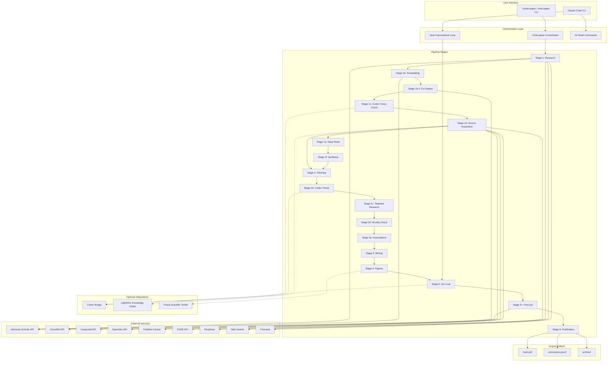
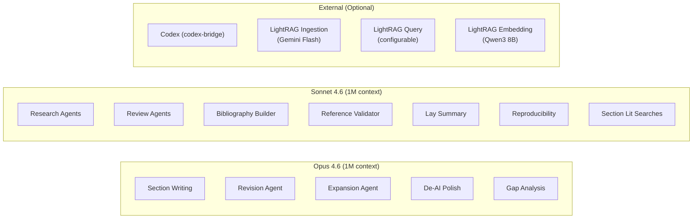
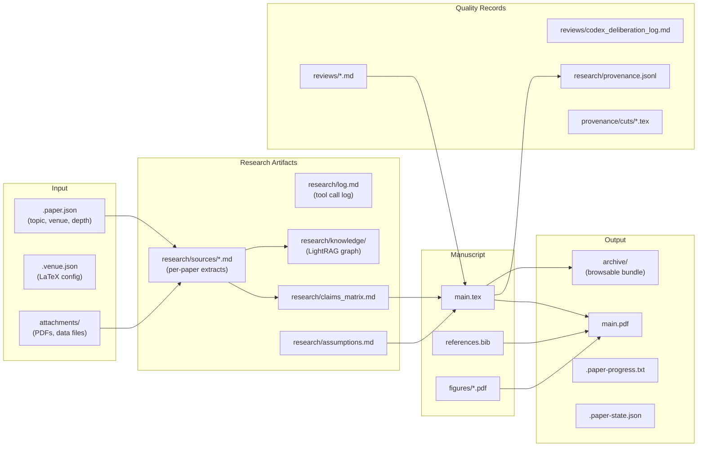
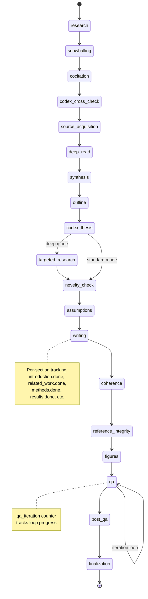
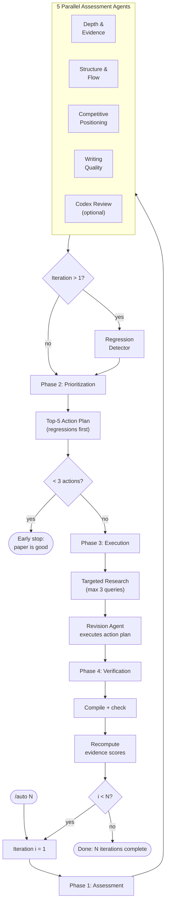
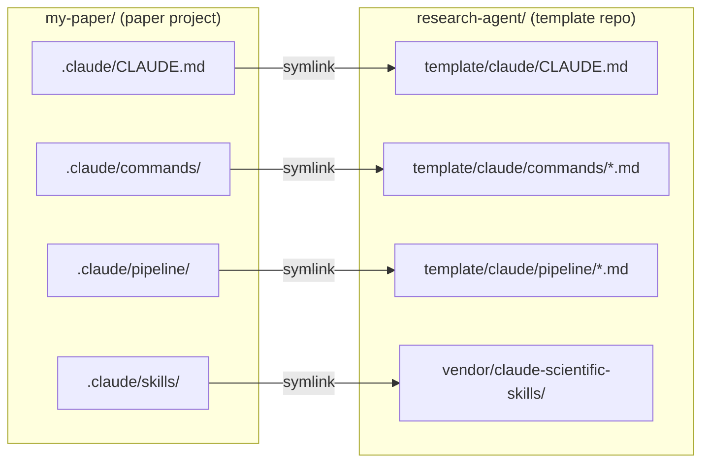
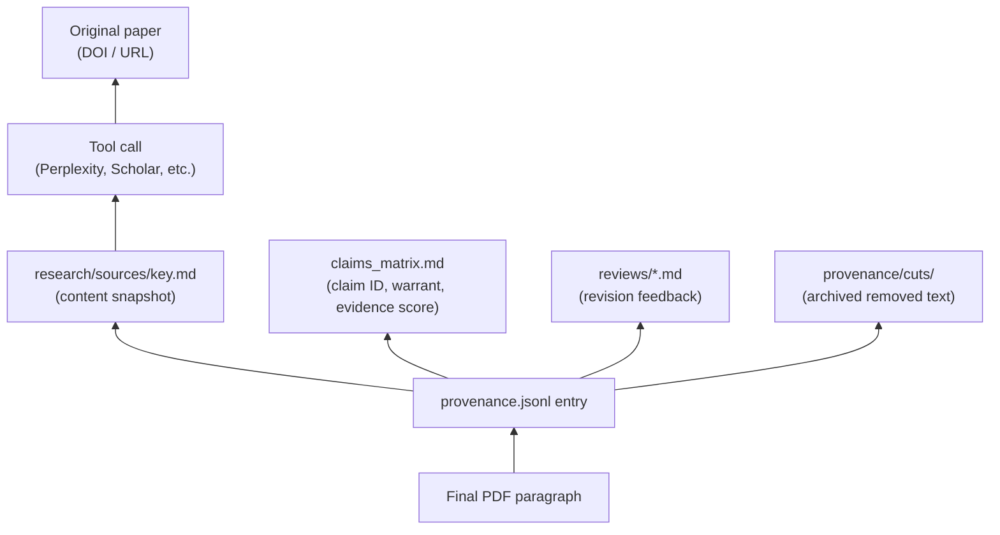
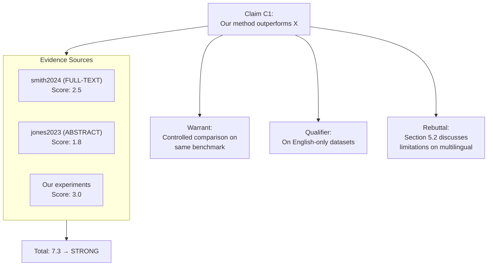
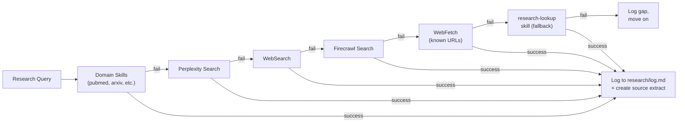

# Architecture

Visual guide to the Research Agent system architecture, pipeline flow, data model, and agent orchestration.

## System Overview



## Pipeline Flow

The `/write-paper` orchestrator reads stage instructions from `pipeline/*.md` files on-demand. Each file is read fresh from disk before execution, preventing context compression from degrading late-stage instructions.

```mermaid
flowchart TD
    Start(["/write-paper topic"]) --> ReadConfig["Read .paper.json\n+ .venue.json"]
    ReadConfig --> ReadProto["Read shared-protocols.md"]
    ReadProto --> DetectDomain["Detect domain\n→ select skills"]

    DetectDomain --> S1["Stage 1: Deep Research"]
    S1 --> |"Read stage-1-research.md"| ResearchAgents

    subgraph ResearchAgents ["Parallel Research Agents"]
        direction LR
        A1["Field Survey"]
        A2["Methodology"]
        A3["Empirical"]
        A4["Theory"]
        A5["Gap Analysis"]
        A6["+ 7 more\n(deep mode)"]
    end

    ResearchAgents --> BibBuild["Bibliography Builder\n→ references.bib"]
    BibBuild --> S1b["Stage 1b: Snowballing\n(backward + forward)"]
    S1b --> S1b2["Stage 1b-ii: Co-Citation\nAnalysis"]
    S1b2 --> S1c{"Codex\ninstalled?"}
    S1c --> |yes| CrossCheck["Codex Cross-Check"]
    S1c --> |no| S1d
    CrossCheck --> S1d["Stage 1d: Source Acquisition"]

    S1d --> AuditSrc["Audit access levels\nFULL-TEXT / ABSTRACT / METADATA"]
    AuditSrc --> OAResolve["OA Resolution\n(7 APIs)"]
    OAResolve --> UserPause{"Paywalled\nPDFs remain?"}
    UserPause --> |yes| WaitUser["Pause for user\nto add PDFs"]
    UserPause --> |no| S1eFlow
    WaitUser --> S1eFlow["Stage 1e: Deep Read\n(parallel PDF agents)"]
    S1eFlow --> KG{"Knowledge\ngraph enabled?"}
    KG --> |yes| BuildKG["Build LightRAG"]
    KG --> |no| S1fFlow
    BuildKG --> S1fFlow["Stage 1f: Synthesis\n(cross-source analysis)"]
    S1fFlow --> S2

    S2["Stage 2: Planning"] --> Thesis["Thesis + Contribution"]
    Thesis --> Outline["Detailed Outline\nwith word targets"]
    Outline --> ClaimsMatrix["Claims-Evidence Matrix\n(warrant, qualifier, rebuttal)"]
    ClaimsMatrix --> S2b2{"Codex?"}
    S2b2 --> |yes| ThesisStress["Codex Thesis\nStress-Test"]
    S2b2 --> |no| Deep1
    ThesisStress --> Deep1{"Deep\nmode?"}
    Deep1 --> |yes| S2c["Targeted Research\n(3 agents)"]
    Deep1 --> |no| S2d
    S2c --> S2d["Novelty Check\n(arXiv, Scholar, DBLP)"]
    S2d --> NovelDecision{"Novel?"}
    NovelDecision --> |no| STOP([Stop Pipeline])
    NovelDecision --> |yes| S2e["Assumptions Analysis"]

    S2e --> S3["Stage 3: Sequential Writing"]
    S3 --> WriteLoop

    subgraph WriteLoop ["Per-Section Agents (Opus)"]
        direction TB
        W1["Introduction"] --> W2["Related Work"]
        W2 --> W3["Methods"]
        W3 --> W4["Results"]
        W4 --> W5["Discussion"]
        W5 --> W6["Conclusion"]
        W6 --> W7["Abstract"]
    end

    WriteLoop --> EvidCheck["Evidence Check\n→ micro-research if gaps"]
    EvidCheck --> S3b["Stage 3b: Coherence\nCheck"]
    S3b --> S3c["Stage 3c: Reference\nIntegrity"]
    S3c --> S4["Stage 4: Figures & Tables"]

    S4 --> PraxisCheck{"Praxis\ndata?"}
    PraxisCheck --> |yes| PraxisFig["Praxis venue-matched\nfigures"]
    PraxisCheck --> |no| MatplotFig["matplotlib figures"]
    PraxisFig --> S5
    MatplotFig --> S5

    S5["Stage 5: QA Loop"] --> QAAgents

    subgraph QAAgents ["Parallel Review (up to 5-8 iterations)"]
        direction LR
        R1["Technical\nReviewer"]
        R2["Writing Quality\nReviewer"]
        R3["Completeness\nReviewer"]
        R4["Codex Adversarial\n(optional)"]
    end

    QAAgents --> Synthesize["Synthesize issues\n→ prioritized fix list"]
    Synthesize --> RevisionAgent["Revision Agent\n(Opus)"]
    RevisionAgent --> QAGates{"Quality\ngates pass?"}
    QAGates --> |no| QAAgents
    QAGates --> |yes| PostQA

    subgraph PostQA ["Post-QA Audits"]
        direction LR
        PQ1["Consistency\nChecker"]
        PQ2["Claims\nAuditor"]
        PQ3["Reproducibility\nChecker"]
        PQ4["Reference\nValidator"]
        PQ5["Codex Risk\nRadar"]
    end

    PostQA --> S6["Stage 6: Finalization"]
    S6 --> ScoopCheck["Scooping Check\n(recent preprints)"]
    ScoopCheck --> DeAI["De-AI Polish"]
    DeAI --> Compile["Compile PDF"]
    Compile --> ArchiveStep["Archive Artifacts"]
    ArchiveStep --> Done(["main.pdf + provenance"])
```



## Agent Model Tiers



## Data Flow



## Checkpoint & Resume

The pipeline tracks progress in `.paper-state.json`, enabling resume-on-interrupt:



## `/auto` Improvement Loop



## Project Directory Layout

```
paper-project/                     # Created by create-paper
├── main.tex                       # Primary LaTeX document
├── references.bib                 # BibTeX references
├── .paper.json                    # Topic, venue, depth, authors
├── .venue.json                    # Venue template (copy from venues/)
├── .paper-state.json              # Checkpoint state (auto-managed)
├── .paper-progress.txt            # Human-readable progress
├── figures/                       # Generated and imported figures
├── attachments/                   # Reference PDFs, data files
├── research/
│   ├── sources/                   # Per-paper source extracts
│   │   ├── smith2024.md
│   │   └── jones2023.md
│   ├── knowledge/                 # LightRAG graph (gitignored)
│   ├── log.md                     # Research provenance log
│   ├── provenance.jsonl           # Machine-readable provenance
│   ├── claims_matrix.md           # Claims-evidence mapping
│   └── assumptions.md             # Methodological assumptions
├── reviews/                       # Review feedback
│   ├── technical_review.md
│   ├── writing_review.md
│   └── codex_deliberation_log.md
├── provenance/
│   └── cuts/                      # Archived cut content
├── archive/                       # Browsable bundle (end of pipeline)
└── .claude/
    ├── CLAUDE.md                  # Workspace instructions (symlink)
    ├── commands/                  # 35 slash commands (symlinks)
    ├── pipeline/                  # Stage instructions (symlinks)
    │   ├── shared-protocols.md
    │   ├── stage-1-research.md
    │   ├── ...
    │   └── auto-phase-4-verification.md
    └── skills/                    # → vendor/claude-scientific-skills
```

## Symlink Architecture

Paper projects use symlinks back to the Research Agent template, enabling instant updates across all papers:



The `sync-papers` script migrates older paper projects to use symlinks.

## Provenance Chain

Every paragraph in the final PDF traces back through:



## Claims-Evidence Matrix



Evidence density scoring:

| Rating | Score | Writing guidance |
|-|-|-|
| STRONG | >= 6.0 | Confident language |
| MODERATE | 3.0 - 5.9 | Standard academic hedging |
| WEAK | 1.0 - 2.9 | Hedged language required |
| CRITICAL | < 1.0 | Must resolve before finalization |

## Tool Fallback Chain


